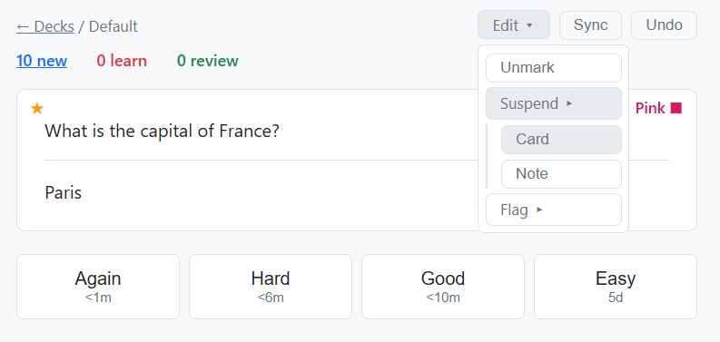
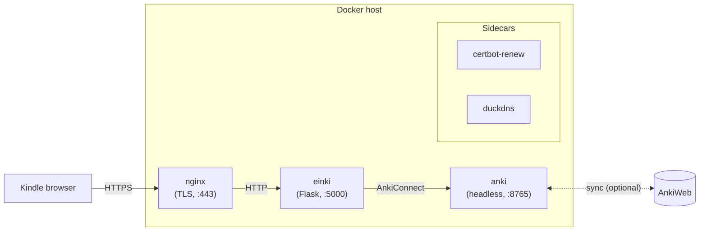

<h1 align="center">

</h1>

<p align="center"><em>Anki for e-ink devices.</em></p>

einki lets you revise your Anki flashcards from anywhere on your Kindle's
built-in web browser. It is a small Flask server that drives a headless
copy of Anki in the background — scheduling, grading, and sync are all
done by real Anki, so your deck stays compatible with every other Anki
client.

## Screenshots

<p align="center">

</p>

## Features

The browser UI keeps things lean but covers the day-to-day Anki workflow:

- **Deck list** with new / learning / review counts at a glance.
- **Study view** with show-answer and the standard four ease buttons
  (Again / Hard / Good / Easy), including next-review intervals.
- **Mark** notes with a star — shown top-left of the card.
- **Flag** cards in any of the seven Anki colors (red, orange, green,
  blue, pink, turquoise, purple) — shown top-right of the card as
  e.g. `Blue ■`, tinted on color screens, readable as plain text on
  monochrome e-ink.
- **Suspend** a single card or the whole note from the same Edit menu.
- **Undo** the last action.
- **Sync** with AnkiWeb on demand from the header.
- **Image and audio** fields render inline — same look as the Anki
  desktop client.

## Kindle compatibility

Designed for and tested on the Kindle's built-in "Experimental"
browser (Kindle Paperwhite, 11th generation). Any modern browser
works, but the UI is deliberately plain: no JS frameworks, no
flexbox `gap`, no emoji, and each action is a full page load —
all so the e-ink browser stays happy.

## Architecture



einki ships as a single opinionated stack: nginx terminates TLS, a
Let's Encrypt cert is obtained and renewed against a DuckDNS
subdomain, and einki talks to a headless Anki via AnkiConnect. The
only genuinely optional piece is the AnkiWeb link — everything else
is baked into the compose file and nginx config.

Running with a different TLS setup (a paid domain, your own nginx
in front, no TLS at all on a trusted LAN, etc.) is supported, but
there is no command-line switch for it: you edit
`docker-compose.yml`, `docker/nginx/default.conf`, and possibly
`scripts/setup_https.sh` to suit your environment. See
[*Running a different setup*](#running-a-different-setup) below.

## Requirements

- Docker Engine + Docker Compose plugin.
- An Anki collection (either a fresh one or synced from AnkiWeb).
- For the shipped deployment:
  - A free [DuckDNS](https://www.duckdns.org) subdomain and token.
  - A host reachable from the internet with ports 80 and 443 open.

## Quick start (local)

```bash
docker compose -f docker-compose.yml -f docker-compose.dev.yml up --build -d
uv run python scripts/seed_cards.py   # optional: add sample cards
```

Then open <http://localhost:5000> from any device on your LAN. The
dev compose override disables nginx / DuckDNS / certbot and exposes
Flask directly on port 5000 — this is **only meant for local
development**, not as a permanent HTTP-only deployment (Flask dev
server, weak default credentials in `.env.dev`, `--debug` enabled).

Log in with `admin` / `secret`.

## Deploying to AWS Lightsail (Ubuntu)

These instructions target the smallest usable Lightsail plan
(1 GB RAM, 2 vCPUs, 40 GB SSD) running Ubuntu LTS. Larger tiers work
without changes.

### 1. Create the instance

- Lightsail console → *Create instance* → Linux/Unix → Ubuntu LTS.
- **Networking** tab: open ports `22` (SSH), `80` (HTTP), and `443`
  (HTTPS). Leave everything else closed.

### 2. Copy the repo from your workstation

```bash
./scripts/copy_to_remote.sh <host>     # e.g. ubuntu@lightsail-ip
```

This rsyncs the repo to `~/einki` on the remote, skipping caches,
build artifacts, and `.env`.

### 3. Install Docker

SSH into the server and run the installer from the copied repo:

```bash
ssh <host>
cd ~/einki
./scripts/install_docker_ubuntu.sh
```

Log out and back in so the `docker` group takes effect.

### 4. Configure secrets

On the server:

```bash
cd ~/einki
cp .env.example .env
chmod 600 .env
$EDITOR .env                           # follow the comments in the file
```

`.env` is gitignored and never leaves the server.

### 5. Bootstrap HTTPS and start the stack

```bash
./scripts/setup_https.sh
```

This one-off script registers the DuckDNS subdomain, obtains a
Let's Encrypt certificate via the DNS-01 challenge, and starts all
services. From then on, routine operations use plain Docker Compose:

```bash
docker compose up -d --build          # rebuild + start (e.g. after code changes)
docker compose restart einki          # restart a single service
docker compose down                   # stop everything
```

Certificate renewal is fully automatic — the `certbot-renew` sidecar
checks every 12 hours, and nginx reloads every 6 hours to pick up
fresh certs. The `duckdns` sidecar keeps the A record pointing at the
current IP. No cron, no systemd.

See [`docker/nginx/README.md`](docker/nginx/README.md) for the TLS
pipeline in more detail.

### 6. First-time AnkiWeb sync (optional)

If you want your existing AnkiWeb collection on the server, sync once
via VNC. AnkiConnect can't click through the "Download from AnkiWeb?"
dialog, so this step needs the GUI.

From your workstation:

```bash
ssh -L 5900:localhost:5900 <host>
```

Then point any VNC viewer (TigerVNC, RealVNC, macOS Screen Sharing,
…) at `localhost:5900`. In the Anki GUI: *Tools → Preferences →
Syncing*, log in, click *Sync*, confirm the full download. All
subsequent syncs happen automatically via AnkiConnect.

If the sync token doesn't persist after a restart (rare), run
`scripts/debug_anki.sh` and check that `syncKey` in `prefs21.db` is
non-empty.

## Running a different setup

The shipped configuration is HTTPS via DuckDNS + Let's Encrypt. There
is no runtime flag to swap in a different DNS provider or skip TLS
entirely — making those changes means editing the repo:

- **Different DNS provider.** Replace the `duckdns` service in
  `docker-compose.yml` and the auth/cleanup hooks in
  `docker/certbot/hooks/` with your provider's equivalents.
- **HTTP-only on a trusted LAN.** Drop the `nginx`, `duckdns`, and
  `certbot-renew` services from `docker-compose.yml`, expose einki's
  port 5000 to the host, and skip `setup_https.sh`. Note: the Flask
  dev server is not appropriate for long-running use; put einki
  behind a production WSGI server (gunicorn, uwsgi) if you go this
  route.
- **Your own reverse proxy.** Keep `einki` + `anki`, remove `nginx` +
  the certbot/duckdns services, expose einki to the host, and proxy
  to it from your existing nginx / Caddy / Traefik.

## Development

```bash
# Dev stack: Flask --debug, reloader on, nginx bypassed, src/ bind-mounted.
docker compose -f docker-compose.yml -f docker-compose.dev.yml up --build -d
```

Edits to `src/` trigger Flask's auto-reloader inside the container.
Uncaught exceptions render the Werkzeug interactive debugger —
**never** enable debug mode in production; the in-browser debugger is
effectively an RCE surface.

Bare-metal (no Docker):

```bash
export EINKI_USERNAME=admin EINKI_PASSWORD=secret
uv run einki
```

### Environment files

| File          | Committed? | Purpose                                                            |
|---------------|------------|--------------------------------------------------------------------|
| `.env`        | No         | Real production secrets. Created from `.env.example`.              |
| `.env.example`| Yes        | Template with placeholder values.                                  |
| `.env.dev`    | Yes        | Safe dev defaults (`admin`/`secret`). Loaded by `docker-compose.dev.yml`. |

### Compose tips

```bash
docker compose ps                       # show running containers
docker compose logs -f einki            # follow logs
docker compose up -d --build einki      # rebuild & restart after code changes
docker compose down -v                  # stop + delete data volume (clean slate)
```

After editing einki source code, `restart` is not enough — you need
`up -d --build` to pick up the new image.

### Scripts

| Script                                 | Purpose                                                      |
|----------------------------------------|--------------------------------------------------------------|
| `scripts/install_docker_ubuntu.sh`     | Install Docker Engine + Compose on Ubuntu (apt-based only).  |
| `scripts/copy_to_remote.sh <host>`     | rsync the repo to `~/einki` on a remote host.                |
| `scripts/setup_https.sh`               | One-off HTTPS bootstrap (DuckDNS + Let's Encrypt).           |
| `scripts/debug_anki.sh`                | Inspect the Anki data volume (sync state, `prefs21.db`).     |
| `scripts/seed_cards.py`                | Add 10 sample flashcards via AnkiConnect.                    |
| `scripts/run_checks.sh`                | Run ruff, ty, mypy, and pytest.                              |
| `docker/anki-headless/manual_build.sh` | Build the headless-anki Docker image.                        |

### CLI options (outside Docker)

```
uv run einki [OPTIONS]

--host        Host to bind to (default: 127.0.0.1)
--port        Port to bind to (default: 5000)
--username    Auth username (default: EINKI_USERNAME env var)
--password    Auth password (default: EINKI_PASSWORD env var)
--anki-url    AnkiConnect URL (default: http://127.0.0.1:8765, or ANKI_URL env var)
--debug       Run Flask in debug mode (auto-reload, debugger)
-v/--verbose  Enable debug logging
```

### Future work

**MPA vs AJAX.** einki uses the classic multi-page model: each Mark /
Sync / Answer click submits a form, the server redirects, and the
browser re-renders the whole page. State that needs to survive an
action (e.g. "the answer was already revealed") is round-tripped
through hidden form inputs and query-string flags. This is verbose
but works reliably on the Kindle browser, which has only minimal
JavaScript support. Moving to AJAX (a `fetch` + a DOM toggle) would
be snappier, but is risky on Kindle and needs real-hardware testing
before committing.
